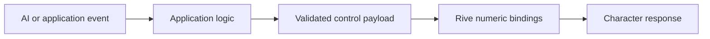

# Rive AI Avatar Starter

**A small, inspectable web starter for connecting a Rive character to AI assistant activity.**

Built by [Mascot Engine](https://mascotengine.com/) for developers who need an explicit contract between application events and character animation.


> **Bring your own `.riv` file.** This repository does not include a Rive character or an AI backend. The default preview is an original CSS schematic, clearly labeled in the interface. Loading a compatible `.riv` export switches the preview to the actual Rive runtime.

## What you can do

- Explore seven activities: idle, listening, thinking, speaking, success, error/offline and sleeping.
- Adjust emotion, a mouth-shape index, speaking amplitude and two-axis gaze.
- Load a local `.riv` file without sending its bytes to an app server.
- Connect numeric Data Binding properties or legacy numeric State Machine inputs.
- Validate all six control names before enabling the character.
- Run a scripted conversation to inspect transitions and interruption behavior.
- Inspect the complete control payload beside the preview.

The demo does **not** recognize speech, generate responses, estimate phonemes, record audio, or provide automatic lip sync. The viseme control selects an index that your character must implement. The simulated amplitude is synthetic.

## Quick start

Requires Node.js **22.12 or newer** and npm.

```sh
git clone https://github.com/uianimation/rive-ai-avatar-starter.git
cd rive-ai-avatar-starter
npm ci
npm run dev
```

Open the local URL printed by Vite. The schematic works immediately. No API key is required.

```sh
npm test          # control and binding contract tests
npm run build    # production bundle, including the Rive WASM asset
npm run preview  # inspect the production build locally
```

The lockfile pins the dependency graph. The Rive WASM file is bundled from the installed package rather than loaded from an unpinned CDN. `base: './'` supports hosting beneath a repository path.

## Connect a character

1. Export a `.riv` file from Rive that implements [the character contract](docs/character-contract.md).
2. Choose the file in **Connect your Rive character**. The app limits files to 20 MB.
3. Enter its State Machine name and optionally its artboard name. Names are case-sensitive.
4. Select **Data Binding** for numeric properties on the artboard's default View Model instance, or **Legacy numeric inputs** for a matching State Machine.
5. Select **Load character**. Missing properties, incorrect types and unknown State Machine names produce an error and retain the schematic fallback.

Only exports with all six numeric controls are accepted. Existing characters often use different names, enums or ranges; adapt `src/bindings.js` and `src/contract.js` explicitly for those files. Loading a file does not create animations or bindings inside it.

## Control contract

| Name | Type | Values | Default |
| --- | --- | --- | --- |
| `activity` | Number, integer | 0 idle, 1 listening, 2 thinking, 3 speaking, 4 success, 5 error/offline, 6 sleeping | 0 |
| `emotion` | Number, integer | 0 neutral, 1 happy, 2 concerned | 0 |
| `viseme` | Number, integer | 0 closed/rest, 1–14 character-defined shapes | 0 |
| `audioLevel` | Number | 0–1, normalized speaking amplitude | 0 |
| `lookX` | Number | -1 left to +1 right, from the viewer's perspective | 0 |
| `lookY` | Number | -1 up to +1 down, from the viewer's perspective | 0 |

Values are clamped. Unknown controls and non-finite/non-number values are rejected. Leaving the speaking activity clears `viseme` and `audioLevel`, including on interruption. Emotion and gaze remain independent.



## Wire application events

`src/contract.js` is independent of the renderer. This example assumes you have already loaded a compatible Rive instance:

```js
import { StateMachineInputType } from '@rive-app/webgl2';
import { createController } from './src/contract.js';
import { resolveBindings } from './src/bindings.js';

// Call after Rive's onLoad event, with autoBind: true.
const write = resolveBindings(riveInstance, 'data-binding', 'Avatar', StateMachineInputType.Number);
const avatar = createController(write);
avatar.reset();

avatar.set({ activity: 1 }); // microphone session started by your app
avatar.set({ activity: 2 }); // your app is waiting for a response
avatar.set({ activity: 3, audioLevel: 0.4, viseme: 2 }); // playback data
avatar.set({ activity: 0 }); // playback ended: mouth controls reset
```

Keep provider keys on your server. Drive mouth shapes from your speech provider's timestamps, aligned to actual audio playback; this starter supplies neither timestamps nor a universal phoneme mapping. Treat RMS amplitude as an approximation of mouth openness, not phonetic lip sync.

## Project structure

```text
src/
  contract.js           # ranges, defaults and interruption policy
  bindings.js           # resolve the Rive properties once after load
  main.js               # lifecycle, local file loading and demo controls
  style.css             # responsive UI and CSS schematic
docs/
  character-contract.md # authoring and handoff specification
  integration.md        # runtime boundary and platform notes
  testing.md            # verification scope and manual test checklist
tests/
  contract.test.js
  bindings.test.js
```

## Scope and compatibility

This release implements the **Web** integration using `@rive-app/webgl2` 2.42.0. It requires a WebGL2-capable browser. Flutter and React Native can reuse the *documented character contract*, but this repository does not ship or claim tested native adapters. Their runtime APIs and feature support must be checked separately.

The app pauses the Rive runtime and stops scripted events when the document becomes hidden. It cleans up the runtime on unload/replacement, resizes the drawing surface with its container, and respects reduced-motion preferences for the CSS schematic. Your Rive file needs its own reduced-motion policy. See [integration notes](docs/integration.md) and [testing scope](docs/testing.md).

## Deployment

`npm run build` produces `dist/`. Serve that directory with a static host that serves `.wasm` as `application/wasm`. No server application is required. GitHub Pages deployment is provided as a manual workflow; enable **Settings → Pages → Source: GitHub Actions**, then run **Deploy demo** from Actions. The production demo can be hosted at `https://uianimation.github.io/rive-ai-avatar-starter/` after that workflow succeeds.

## Contributing and asset rights

See [CONTRIBUTING.md](CONTRIBUTING.md). Code and the CSS schematic are MIT licensed; see [LICENSE](LICENSE). That license does not grant rights to the Mascot Engine name, third-party assets, or files you load yourself. Publish only assets you have permission to distribute. The Rive runtime retains its own upstream license.

## Need a custom character?

[Mascot Engine](https://mascotengine.com/) creates interactive app mascots, AI companions, Rive State Machines, character rigging, viseme lip sync, gaze controls and developer handoffs for Web, Flutter and React Native.

[Explore services](https://mascotengine.com/services/) · [Send a project brief on WhatsApp](https://wa.me/94717000999)

For a useful estimate, include your platform, required interactions, voice/lip-sync needs, timeline and budget range.

## Primary references

- [Rive Web runtime](https://rive.app/docs/runtimes/web/web-js)
- [Rive Data Binding](https://rive.app/docs/runtimes/web/data-binding)
- [Rive State Machine playback](https://rive.app/docs/runtimes/web/state-machines)
- [Rive runtime feature support](https://rive.app/docs/runtimes/feature-support)

Independent community starter by Mascot Engine; not an official Rive product.
